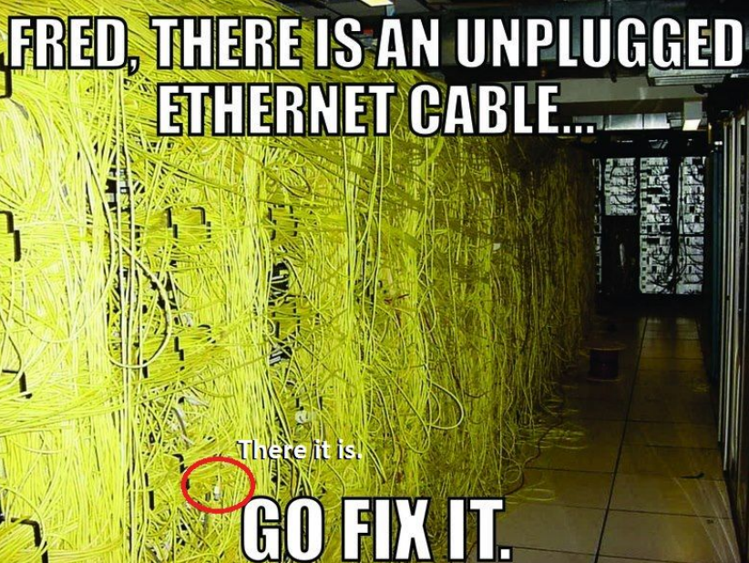

# NetPractice
NetPractice is a general practical exercise to let you discover networking.

### What is NetPractice?
NetPractice is an individual project at [42](42sp.org.br) that requires us to  configure small-scale networks.
In a network, devices need to communicate. For this, [communication protocols](https://en.wikipedia.org/wiki/Communication_protocol) and models were created. Among them, there is the [TCP/IP model](https://www.geeksforgeeks.org/tcp-ip-model/). [TCP/IP](https://en.wikipedia.org/wiki/Internet_protocol_suite) is a set of [communication protocols](https://en.wikipedia.org/wiki/Communication_protocol). The name comes from two protocols TCP [(Transmission Control Protocol)](https://en.wikipedia.org/wiki/Transmission_Control_Protocol) and the IP [(Internet Protocol)](https://en.wikipedia.org/wiki/Internet_Protocol). It aims to standardize all network communications, particularly web communications. When configuring [TCP/IP](https://en.wikipedia.org/wiki/Internet_protocol_suite) settings on a device, a [subnet mask](https://en.wikipedia.org/wiki/Subnetwork) must be specified. This mask allows the device to determine which [IP addresses](https://en.wikipedia.org/wiki/IP_address) are on the [local network](https://en.wikipedia.org/wiki/Local_area_network) and which should be reached by a [gateway](https://whatismyipaddress.com/gateway) in the device's [routing table](https://en.wikipedia.org/wiki/Routing_table).

### I think we'll be OK now
With big powers come big responsabilities.

### Badge

#### Skills
- Network & system administration
- Rigor

#### My grade

## 📝 License

This project is licensed under the GNU General Public License v3.0 - see the [LICENSE](license) file for details.

---

Made by Welton Leite 👋 [See my linkedin](https://www.linkedin.com/in/welton-leite-b3492985/)
